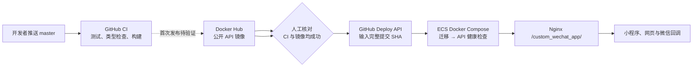

# 小程序模板：从代码到线上 API 的部署链路

这份记录以本仓库 2026-09-29 的实际部署为准，供第一次接触 CI/CD、镜像仓库和 Docker Compose 的团队成员阅读。它记录当前已经跑通的部分、尚待验证的 Docker Hub 公开镜像发布，以及下一次发布时该怎么操作。所有命令均不包含生产密钥。

## 先记住四件事

1. **GitHub 检查并发布镜像。** 推送 `master` 后，GitHub Actions 的 CI 会安装依赖、在临时 PostgreSQL 上验证 Prisma 迁移，并运行测试、类型检查和构建；检查通过后再构建 API Docker 镜像并推送到 Docker Hub。它不会连接生产数据库；CI 成功也不表示新 API 已上线。
2. **Docker Hub 存 Docker 镜像。** 目标仓库是公开的 `jojoshine/custom-wechat-api`，镜像标签使用完整提交 SHA；ECS 匿名拉取。这个发布链路尚待首次验证。当前线上仍运行先前已验证的 ACR 镜像。
3. **ECS 运行镜像。** GitHub 的 `Deploy API` 手动工作流通过 SSH 连接 ECS，在 `/opt/server/custom_wechat_app` 使用 Compose 拉取指定镜像，先运行 Prisma 迁移，再启动 NestJS API 并等待健康检查。PostgreSQL 是服务器上已有的服务，Compose 不创建数据库。
4. **Nginx 提供公网入口。** API 容器监听 `3000`，宿主机映射到 `127.0.0.1:3101`。Nginx 容器与 API 容器共享 Docker 网络，将公网 `/custom_wechat_app/` 前缀去掉后转发给 API。



图中虚线是**尚未完成首次验证**的 Docker Hub 发布。`publish-api` 作业依赖 `verify` 成功；部署前仍需确认镜像确实存在且 ECS 可以拉取。

## 当前状态与证据

| 环节 | 状态 | 验证方式或结果 |
| --- | --- | --- |
| GitHub `master` 与 CI | 已验证 | [最新 CI](https://github.com/JojoShine/custom_wechat_app/actions/runs/36590694055)只有 `verify` 作业，测试、类型检查和构建通过。 |
| ACR 私有仓库与 ECS 内网推送 | 已验证 | 镜像 `counttech/custom-wechat-api:11cf27e945a89fcd555cb7b90603b181358c7c22` 已从 ECS 推入杭州 ACR。 |
| GitHub CI 发布 Docker Hub 公开镜像 | **待验证** | 需要 Docker Hub 仓库设为 Public、GitHub 配置推送 Token，并完成首次 CI 发布与 ECS 拉取。 |
| GitHub 手动部署工作流 | 已验证 | 曾用上述镜像标签运行 [Deploy API](https://github.com/JojoShine/custom_wechat_app/actions/runs/36589993518)，工作流成功。 |
| ECS API 与 HTTPS 健康接口 | 已验证 | 容器状态为 healthy；[公网健康接口](https://tbtparent.me/custom_wechat_app/health)返回 200 和 `{"status":"ok"}`。 |
| 微信支付通知、退款通知、OSS、真实小程序请求 | **未做生产联调** | 健康接口通过不能证明这些业务路径已联通。 |

当前镜像来自较早的 API 源码提交；该提交到切换发布链路前的 `master` 之间 API 与 workspace 依赖源码未变化。下一次发布应先验证 Docker Hub 新镜像，再使用其完整提交 SHA 部署。

## 首次配置：每个环境只做一次

### 1. GitHub 与 Docker Hub

将 Docker Hub 的 `jojoshine/custom-wechat-api` 仓库设为 Public；GitHub Actions 增加有推送权限的 `DOCKERHUB_TOKEN` Secret。`master` 的 `verify` 成功后，`publish-api` 才会使用仓库根目录 `Dockerfile` 构建 `linux/amd64` 镜像，并以完整提交 SHA 作为标签推送。首次切换要在 ECS 上验证拉取公开镜像的速度。此前的慢点是 GitHub 构建机向杭州 ACR 上传大镜像层；这次不再走那段传输。

### 2. ECS 与 GitHub 部署凭据

ECS 的 `/opt/server/custom_wechat_app/.env.production` 保存数据库连接、JWT、微信、OSS 等运行时配置，权限为 `600`；这些值不进入 Git、镜像或 GitHub Actions。公开 Docker Hub 镜像可匿名拉取。GitHub 保存部署所需的 `DEPLOY_HOST`、`DEPLOY_USER`、`DEPLOY_DIR` 变量，以及专用 SSH 私钥和已核对的主机公钥 Secret。专用 SSH 公钥已安装在 ECS 的部署账户；若更换账户，需同步更换 GitHub 配置。

Compose 文件为 [`docker-compose.prod.yml`](../docker-compose.prod.yml)，部署脚本为 [`scripts/deploy-production.sh`](../scripts/deploy-production.sh)。数据库迁移是一次性 `migrate` 服务；它失败时 API 不会启动。API 容器健康检查请求容器内的 `/health`。

### 3. 公网转发

服务器的 `3100` 已由另一个 Next.js 应用占用，所以本项目使用宿主机 `127.0.0.1:3101`。Nginx 自身也运行在容器中，应加入 `custom-wechat-app-prod_default` 网络，并在 `tbtparent.me` 的 HTTPS 配置中转发到 `custom-wechat-app-prod-api-1:3000`。`proxy_pass` 地址末尾的 `/` 用来去掉 `/custom_wechat_app/` 前缀。Nginx 容器重建后还要保留这个网络连接。

## 以后发布：按这个顺序走

1. **推送代码。** 将准备发布的变更推到 GitHub `master`。
2. **看 GitHub CI。** 在仓库 Actions 的 `CI` 页面确认 `verify` 和 `publish-api` 都成功；失败时先修代码，不部署该提交。
3. **确认镜像。** 在 Docker Hub 核对完整提交 SHA 的公开镜像已生成。首次发布还需从 ECS 拉取一次，确认连通与速度。
4. **手动部署。** 在 GitHub Actions 的 `Deploy API` 里运行工作流，`image_tag` 填该次提交的完整 SHA。工作流通过 SSH 上传当前 Compose 文件、拉取镜像、更新 ECS `.env.production` 中的 `API_IMAGE`、运行迁移并等待 API 健康。
5. **验收。** 检查工作流成功、公网健康接口返回 200，再对本次改动涉及的业务功能做实际请求验证。健康接口只证明 API 主进程可用。

生产服务器上可用以下只读命令排查，先进入 `/opt/server/custom_wechat_app`：

```bash
docker compose --env-file .env.production -f docker-compose.prod.yml ps
docker compose --env-file .env.production -f docker-compose.prod.yml logs --tail=100 api
docker compose --env-file .env.production -f docker-compose.prod.yml logs --tail=100 migrate
curl -fsS https://tbtparent.me/custom_wechat_app/health
```

**回滚：** 在 `Deploy API` 里重新输入上一个已验证镜像的标签。这样会回滚 API 镜像；Prisma 已执行的数据库迁移不会自动回滚。涉及数据库结构的发布应确保新旧版本在回滚窗口内兼容。

## 这次踩到的坑

| 现象 | 原因 | 处理与以后怎么判断 |
| --- | --- | --- |
| GitHub 的 Docker 构建推送运行近半小时 | 镜像已构建，卡在从 GitHub 构建机上传大层到杭州 ACR；日志中 406 MB 的层约 28 分钟只上传 107 MB。 | 取消该次发布；现有镜像经 SSH 传到 ECS，再从 ECS 使用 ACR VPC 地址推送。后续改为 GitHub 推送 Docker Hub，首次发布仍须验证。 |
| 第一次启动 API 报 `3100` 端口占用 | 服务器上另一个 Next.js 进程已经监听 `3100`。 | 不停止其他服务；把本项目 `API_PORT` 调为 `3101` 后 Compose 启动成功。 |
| API 本地健康为 200，公网为 404 | Nginx 尚未增加 `/custom_wechat_app/` 转发，且 Nginx 在独立容器网络中。 | 让 Nginx 加入 API 网络并配置前缀转发；公网健康接口随后返回 200。 |
| `Deploy API` 一开始在 GitHub 返回 404 | 首次推送后，GitHub 尚未登记纯手动触发的工作流。 | 后续提交推到默认分支后，工作流出现在 Actions 列表；再运行同一镜像标签验证成功。 |

## 名词速查

| 名词 | 在本项目中的意思 |
| --- | --- |
| 镜像 / 容器 | 镜像是可发布的 API 程序包；容器是镜像在 ECS 上的一次运行。 |
| 镜像标签 | 指定某一镜像版本的名字。本项目新链路使用完整 Git 提交 SHA；不要只依赖可能被覆盖的 `latest`。 |
| 公网 / VPC 地址 | 旧链路中，GitHub 上传 ACR 走公网，杭州 ECS 拉取 ACR 走 VPC；新链路从 Docker Hub 公网拉取。 |
| CI / CD | CI 是自动检查代码；这里的 CD 是选定镜像后手动触发部署。两者通过镜像标签衔接。 |
| Prisma 迁移 | 在 API 启动前更新现有 PostgreSQL 的表结构；它不是创建第二个数据库。 |
| 反向代理 | Nginx 接收公网 HTTPS，再把 `/custom_wechat_app/` 请求交给 API 容器。 |

进一步的命令和配置字段见[GitHub CI、Docker Hub 镜像与生产部署](ci-cd.md)及[生产环境 Docker 部署](production-deployment.md)。
